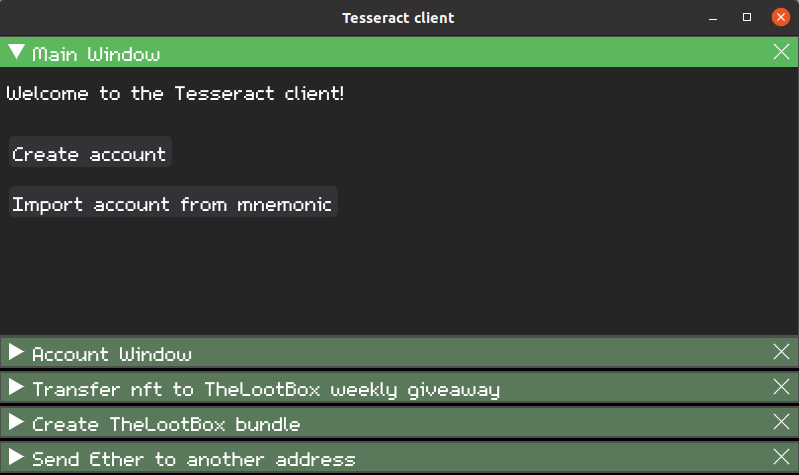

## Disclaimer: This is a very early build and there's a ton of work that needs to be done.



### What is the Tesseract client?

A customizable desktop client (or wallet but I prefer to call Tesseract a client) for Ethereum created with Python, Web3.py, and dearpygui. This client will also be used with the dapp that I'm creating.

Tesseract client currently only supports Linux based OSs. I plan on porting to Windows in the future.

### Why though?

Because web browsers are exploited quite a bit and I like being different. Tesseract Client encrypts credentials at runtime and only decrypts them when needed on disc. This method puts the user more in control of their credentials as the alternative (browser based wallets) still technically store credentials remotely.

---

### Setup

1. I highly recommend setting up a virtual environment, especially if you have projects that could have conflicting dependencies. This is the command to create a virtual environment.

`python3 -m venv envname`

Once the venv is created source it in order to install the dependencies to that environment.

`source path/to/envname/bin/activate`

2. The required dependencies can be installed with pip.

`pip install web3 dearpygui eth-account`

3. There's several environment variables that need to be set depending on what network you want to connect to that `env_vars.py` reads from. (In progress)

4. Sourcing environment variables.

Currently Tesseract only supports one account and the public address for that account.

```python
# Dev setup
dev = os.environ.get("DEV")
key = os.environ.get('ARBITRUM_PRIVATE_KEY')
```

These variables can be set by sourcing a file.

`source .env`

The contents of that file.

```bash
export DEV='YOUR_PUBLIC_KEY'
export KEY='YOUR_PRIVATE_KEY'
```

---

### Creating a network connection

A local node or service endpoint may be used. By default while this is in beta the rinkeby arbitrum network is used for most calls. The network is setup via the `env_vars.py` file.

```python
# Networks setup
web3_local_rinkeby = Web3(Web3.HTTPProvider('http://127.0.0.1:8888'))
web3_arbitrum_rinkeby = Web3(Web3.HTTPProvider('https://rinkeby.arbitrum.io/rpc'))
```

These variables can be changed to other networks by swapping out the `HTTPProvider` endpoint.

---

### Starting the app

This command starts the gui.

`python3 tesseract_client.py`

---

### Support

If you would like to support development here's my eth address `b3nac.eth`.

---

### Resources


[https://dearpygui.readthedocs.io/](https://dearpygui.readthedocs.io/)

[https://web3py.readthedocs.io/](https://web3py.readthedocs.io/)

[https://eth-account.readthedocs.io/](https://eth-account.readthedocs.io/)